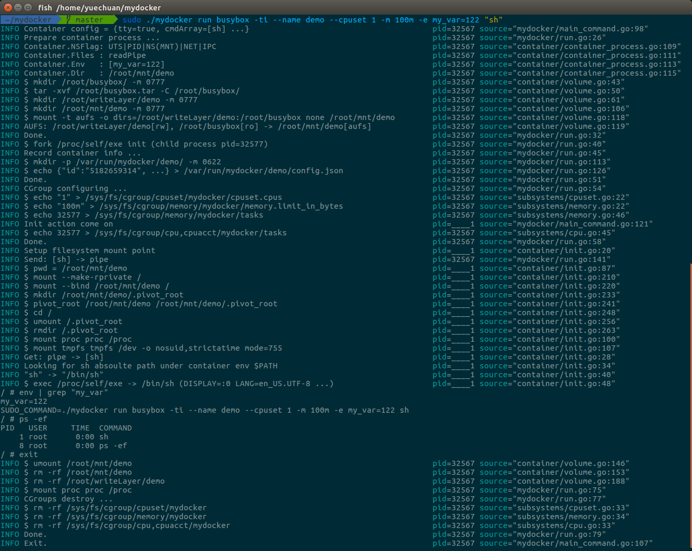

# MyDocker

[](https://travis-ci.org/4x7y/mydocker)




## Container network

```bash
$ sudo ip netns add ns1
$ sudo ip netns add ns2
$ ip netns
ns1
ns2
$ sudo ip link add veth0 type veth peer name veth1
$ ip link
1: lo: <LOOPBACK,UP,LOWER_UP> mtu 65536 qdisc noqueue state UNKNOWN mode DEFAULT group default qlen 1000
    link/loopback 00:00:00:00:00:00 brd 00:00:00:00:00:00
2: enp0s3: <BROADCAST,MULTICAST,UP,LOWER_UP> mtu 1500 qdisc pfifo_fast state UP mode DEFAULT group default qlen 1000
    link/ether 08:00:27:0d:22:ac brd ff:ff:ff:ff:ff:ff
3: docker0: <NO-CARRIER,BROADCAST,MULTICAST,UP> mtu 1500 qdisc noqueue state DOWN mode DEFAULT group default 
    link/ether 02:42:ad:68:78:f8 brd ff:ff:ff:ff:ff:ff
4: veth1@veth0: <BROADCAST,MULTICAST,M-DOWN> mtu 1500 qdisc noop state DOWN mode DEFAULT group default qlen 1000
    link/ether 62:b9:32:91:aa:21 brd ff:ff:ff:ff:ff:ff
5: veth0@veth1: <BROADCAST,MULTICAST,M-DOWN> mtu 1500 qdisc noop state DOWN mode DEFAULT group default qlen 1000
    link/ether 76:96:08:df:4c:91 brd ff:ff:ff:ff:ff:ff
$ sudo ip link set veth0 netns ns1
$ sudo ip link set veth1 netns ns2
$ sudo ip netns exec ns1 ip link
1: lo: <LOOPBACK> mtu 65536 qdisc noop state DOWN mode DEFAULT group default qlen 1000
    link/loopback 00:00:00:00:00:00 brd 00:00:00:00:00:00
5: veth0@if4: <BROADCAST,MULTICAST> mtu 1500 qdisc noop state DOWN mode DEFAULT group default qlen 1000
    link/ether 76:96:08:df:4c:91 brd ff:ff:ff:ff:ff:ff link-netnsid 1
```


```
$ sudo ./mydocker network create testnet --subnet 192.168.0.0/24 --driver bridge
INFO Load "bridge" network driver as default.                                               pid=_2911 source="network/network.go:128"
INFO mkdir /var/run/mydocker/network/network/ -m 0644                                       pid=_2911 source="network/network.go:133"
INFO Walk through default network path /var/run/mydocker/network/network/.                  pid=_2911 source="network/network.go:139"
INFO Allocated IP: 192.168.0.1                                                              pid=_2911 source="network/network.go:179"
INFO Init bridge net = {testnet, 192.168.0.1/24, bridge}                                    pid=_2911 source="network/bridge.go:28"
INFO // Adds a new link device "testnet" (bridge)                                           pid=_2911 source="network/bridge.go:145"
INFO $ ip link add testnet type bridge                                                      pid=_2911 source="network/bridge.go:146"
INFO // Add address 192.168.0.1 with netmask ffffff00 to device bridge                      pid=_2911 source="network/bridge.go:191"
INFO $ ip addr add 192.168.0.1/24 dev bridge                                                pid=_2911 source="network/bridge.go:193"
INFO // Enables the link device "testnet"                                                   pid=_2911 source="network/bridge.go:162"
INFO $ ip link set dev testnet up                                                           pid=_2911 source="network/bridge.go:163"
INFO // Setup iptables                                                                      pid=_2911 source="network/bridge.go:200"
INFO $ iptables -t nat -A POSTROUTING -s 192.168.0.1/24 ! -o testnet -j MASQUERADE          pid=_2911 source="network/bridge.go:201"
INFO $ echo {testnet 192.168.0.1/24 bridge} > /var/run/mydocker/network/network/            pid=_2911 source="network/network.go:83"
```


```
$ sudo ./mydocker network list
INFO Load "bridge" network driver as default.                                               pid=_3848 source="network/network.go:128"
INFO Walk through default network path /var/run/mydocker/network/network/.                  pid=_3848 source="network/network.go:139"
INFO Load network: testnet                                                                  pid=_3848 source="network/network.go:150"
INFO $ open /var/run/mydocker/network/network/testnet = {"Name":"testnet","I ...            pid=_3848 source="network/network.go:116"
NAME        IpRange          Driver
testnet     192.168.0.1/24   bridge
```